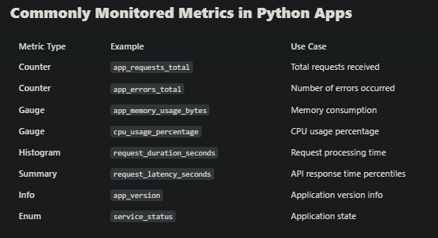
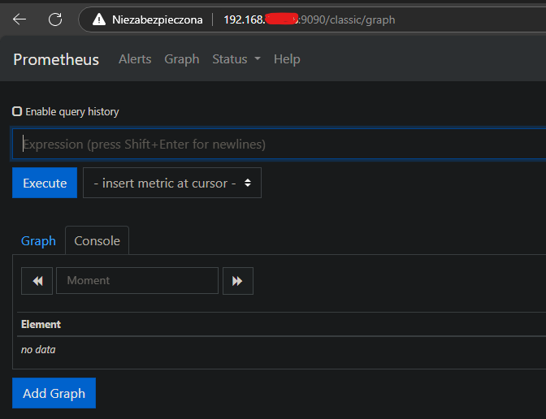
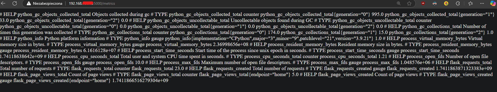
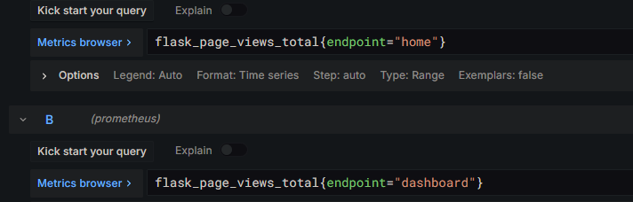
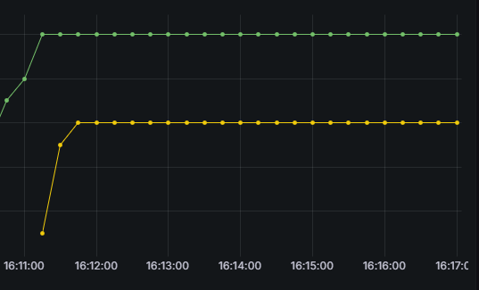
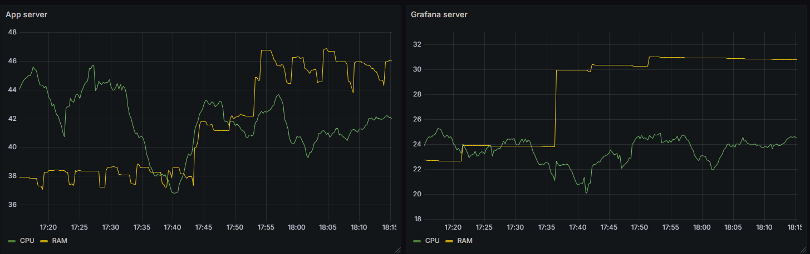

# grafana-for-python-app
Setting up Grafana dashboards that monitor web application created in Python hosted on docker containers

# Grafana Monitoring for Python Application

This project sets up Grafana to monitor the performance and metrics of a Python application. By integrating Grafana with Prometheus and a Python monitoring library (like `prometheus_client`), you can visualize and track various metrics, such as request count, response time, memory usage, and more.

## Table of Contents

- [Prerequisites](#prerequisites)
- [Setup Instructions](#setup-instructions)
- [Metrics Exposed](#metrics-exposed)
- [Grafana Dashboard](#grafana-dashboard)
- [Running the Application](#running-the-application)
- [Configuration](#configuration)
- [Troubleshooting](#troubleshooting)
- [License](#license)

## Prerequisites

Before you begin, ensure that you have the following installed:

- [Python 3.x](https://www.python.org/downloads/)
- [Docker](https://www.docker.com/get-started)
- [Docker Compose](https://docs.docker.com/compose/)
- [Grafana](https://grafana.com/grafana/download)
- [Prometheus](https://prometheus.io/docs/prometheus/latest/installation/)

### Python Dependencies

You'll need the following Python libraries:

```python
#import those libs to your application
from prometheus_client import Counter, generate_latest, make_wsgi_app
from prometheus_client.exposition import basic_auth_handler

# In terminal run this command
 pip install prometheus_client
```

### Grafana

```bash
apt-install grafana-server
```

## Running the App

To communicate with prometheus we need API route to provide a way to send out metrics to client. 
This route setting creates /metrics page that will count requests number for specific endpoints

Declaration of variables that counts page views

```python
# Create a metric to track requests
REQUEST_COUNT = Counter('flask_requests_total', 'Total number of requests')
PAGE_VIEWS = Counter("flask_page_views", "Count of page views", ["endpoint"])
```

And metrics for specific endpoints

```python
@app.route('/metrics')
def metrics():
    # Increment the request counter for each request to the app
    REQUEST_COUNT.inc()
    return generate_latest()

@app.route('/login')
def login():
    PAGE_VIEWS.labels(endpoint="home").inc()

@app.route('/dashboard')
def dashboard():
    PAGE_VIEWS.labels(endpoint="dashboard").inc()
```

and this line that allows the communicate process to run..

```python
if __name__ == "__main__":
    # Expose the Prometheus metrics as a WSGI app
    app.wsgi_app = make_wsgi_app()
```

There is various of metrics that we are able to track via this library. Some of them listed below.
Detailed informations in official docs - https://prometheus.github.io/client_python/instrumenting/



## Configuration 

You need access port 9090 for prometheus api actions, if its disable use following command:

```bash
sudo ufw enable 9090/tcp
```




### Prometheus config

By default its placed under /etc/prometheus/prometheus.yaml, to start monitoring the app endpoint you need add following lines

```yaml
global:
  scrape_interval: 5s  # How often Prometheus scrapes data

scrape_configs:
  - job_name: flask_app
    static_configs:
      - targets: ["IP_ADDRES/HOSTNAME:5000"]
```


### Grafana config

Grafana interface is available on http://localhost:3000. Login and password is admin. Go to settings->data source->prometheus

Set your servername:9090 where you are host the app. If you do it locally its http://localhost:9090.
All metrics that are gathered are available under http://SERVER_NAME:PORT/metrics for example http://localhost:8080/metrics



### Dashboard - app usage

To track number of page's views go query : flask_page_views_total




It looks like this - one colour for one endpoint views line




### Dashboard - server usage

To gather information about resource usage we need different queries. Fortunatelly we dont need to configure anything because prometheus stores basic resource stats by default.
Then lets create a dashboard.

```pomQL
#for CPU
100 - (avg by(instance) (rate(node_cpu_seconds_total{mode="idle"}[5m])) * 100)

#for RAM
100 * (1 - (node_memory_MemAvailable_bytes / node_memory_MemTotal_bytes))
```




